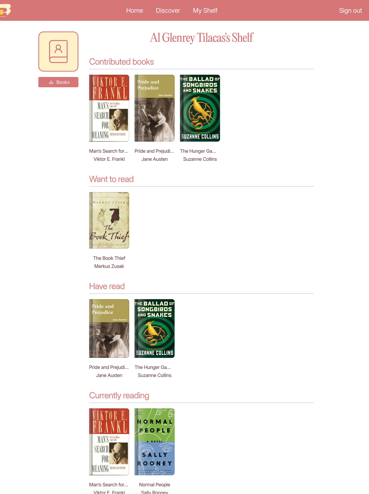
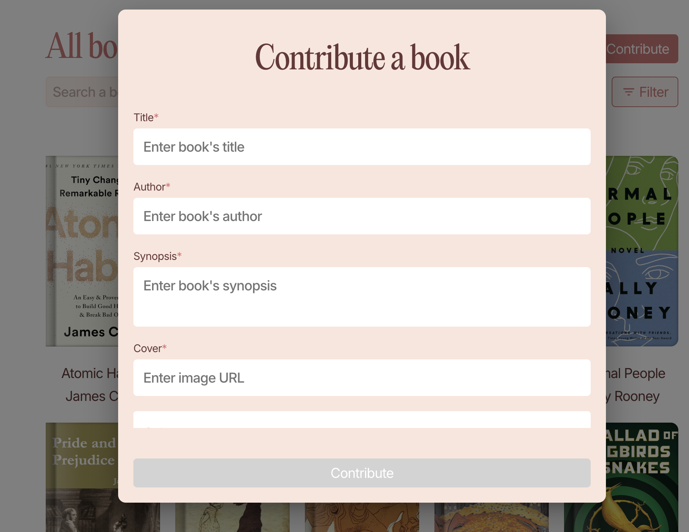
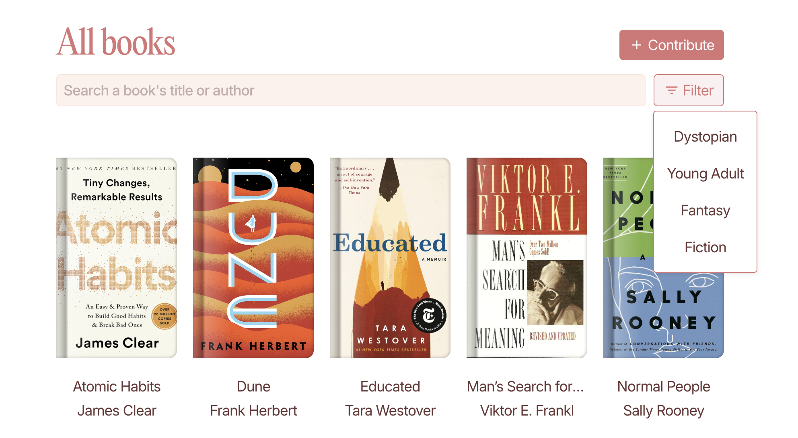
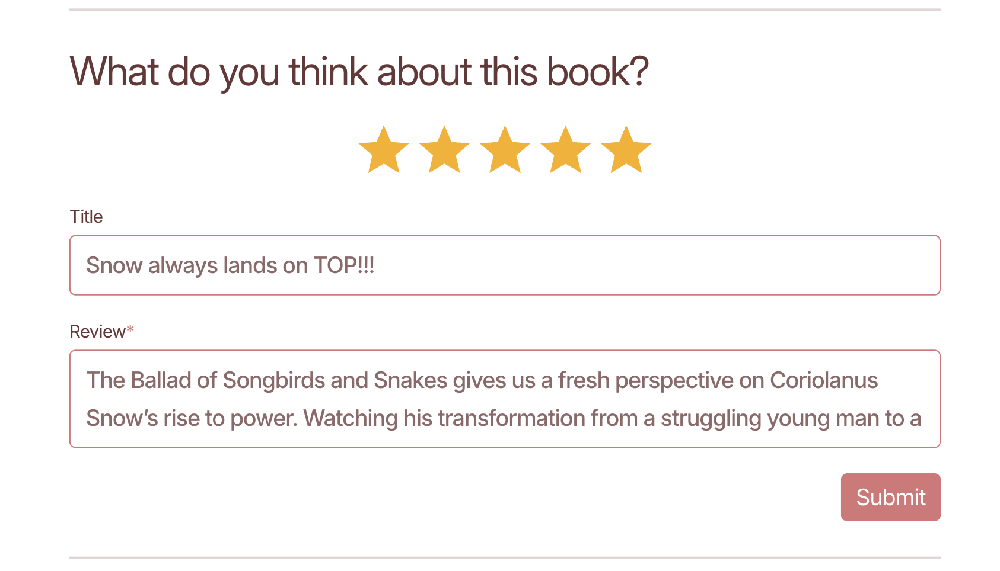
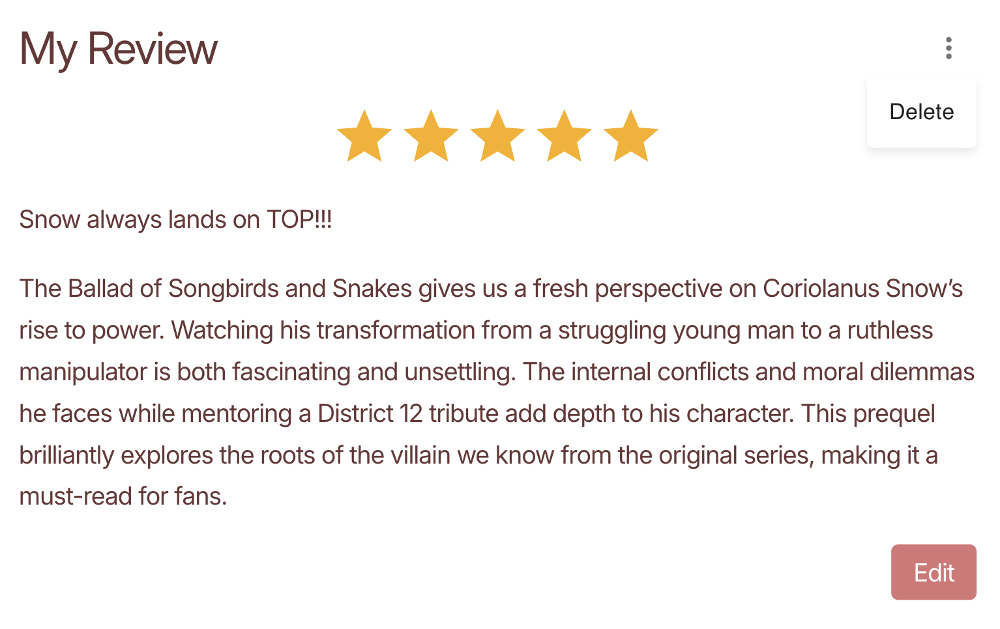
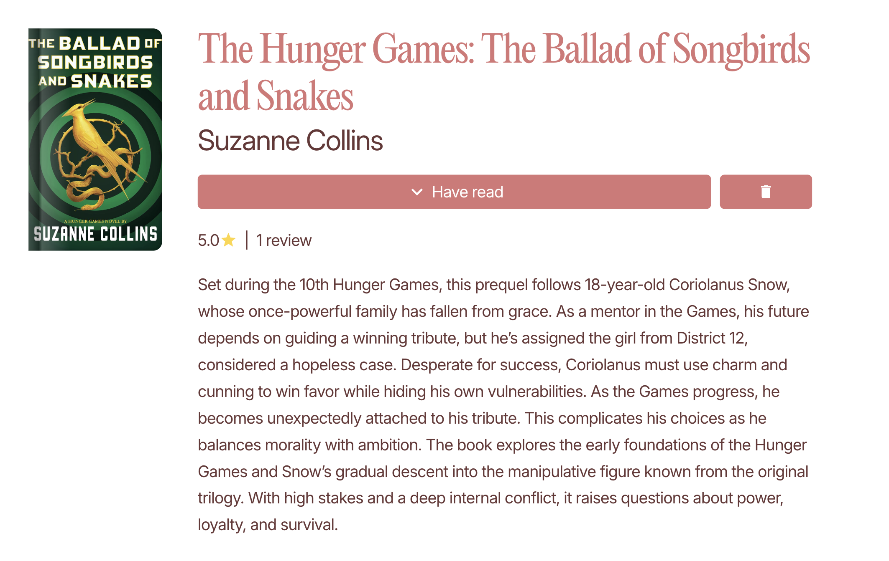
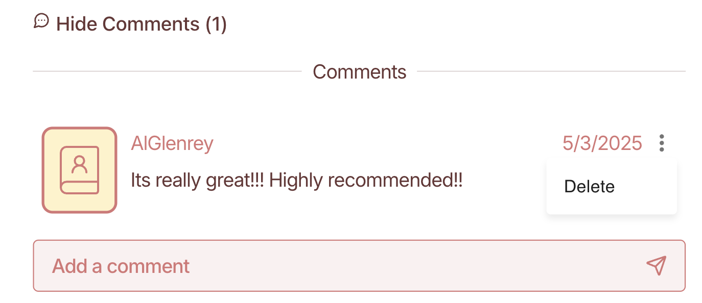

<a name="readme-top"></a>

<br />
<div align="center">
  <a href="https://github.com/larkhiya/126-LE2-frontend">
    
  </a>


  <h3 align="center">Biblion: Let Your Books Roar </h3>

  <p align="center">
    A dynamic platform where book lovers can connect, share reviews, and discover trending reads!
    <br/>
    <br/>
    <br/>
  </p>
</div>

---


## 📖 About The Project

**Biblion** is a collaborative platform for book enthusiasts.  
It allows users to share reviews, leave comments, track their reading journey, and find trending books based on ratings and activity.

### Core Concepts Demonstrated

- Implementation of full CRUD operations (Create, Read, Update, Delete) for books, reviews, and comments
- User authentication and session-based access control
- Relational data modeling using Django ORM (Users ↔ Books ↔ Reviews ↔ Comments)
- Form validation and error handling using Django and React

---

## Features

### User Login & Registration
- Secure registration and login using Django’s authentication system
- Access control for authenticated-only features

### User Profile & Shelf
- View personal book shelf organized by reading status:
  - **Want to Read**
  - **Currently Reading**
  - **Have Read**
  - **Contributed Books**
- Export entire shelf to a downloadable CSV file
- Personalized user page displaying reading activity and contributions
<div></div>


### Book Database and Search
- Add new books (title, author, genre, synopsis, cover image URL)
  <div></div>
- Browse and search books by title or author. Filter books by genre.
  <div></div>


### Add/Edit/Delete Reviews
- Create reviews with a text body, optional title, and 1–5 star rating
  <div></div>
- Edit or delete your own reviews
  <div>   </div>
- View average ratings per book
    <div>  </div>


### Comment on Reviews
- Comment on any review to discuss, agree, or recommend other books
- Delete your own comments with basic moderation tools
  
  <div>
    </div>

### Trending Books & Top Reviewers
- Landing page highlights:
  - Books with the highest average ratings
  - Most reviewed books
  - Most active users (Top reviewers)
  - Recommended Books (Based on the user's top read genre)
 <div></div>

### User-Restricted Actions
- Users must be logged in to:
  - Get personalized book recommendations
  - Contribute (add) a new book
  - Submit, edit, or delete reviews with star ratings
  - Leave or delete comments on reviews
 
<p align="right">(<a href="#readme-top">back to top</a>)</p>

---

### Built With

* [![React][React.js]][React-url]
* [![Django][Django]][Django-url]
* [![SQLite][SQLite]][SQLite-url]
* [![CSS3][CSS3]][CSS3-url]

<p align="right">(<a href="#readme-top">back to top</a>)</p>


<!-- GETTING STARTED -->
## Getting Started

To get a local copy up and running, follow these steps.

### Prerequisites

You’ll need the following installed on your system:

- Python 3.10+
- Node.js 18+
- npm (comes with Node.js)

If you don’t have Node.js and npm installed, you can install them by running:
  ```sh
  npm install npm@latest -g
  ```
Make sure you have Python and Django installed on your system. You can install Django with:
  ```sh
  pip install django
  ```

### Installation

Follow the steps below to get the project running locally:

1. Clone the Repository
* Clone the repository to your local machine:
   ```sh
   git clone https://github.com/github_username/repo_name.git](https://github.com/larkhiya/126-LE2-frontend.git
   git clone https://github.com/ethanny/le2-backend.git
   ```     
2. Set up the Frontend (React)

* Navigate to the frontend directory and install the required npm packages:
   ```sh
   cd frontend
   npm install
   ```
* Start the React development server:
   ```sh
   npm start
   ```
   The React app should now be running at http://localhost:3000.
  
3. Set up the Backend (Django)
* Navigate to the backend directory and create a virtual environment:
   ```sh
   cd backend
   python -m venv venv
   ```
  * Navigate to the backend directory and create a virtual environment:
    * On macOS/Linux:
      ```sh
      source venv/bin/activate
       ```
    * On Windows:
      ```sh
      source venv/bin/activate
       ```
  * Install Django and other dependencies:
    ```sh
     pip install -r requirements.txt
     ```
  * Run database migrations to set up the database:
    ```sh
     python manage.py migrate
     ```
  * Create a superuser (optional, for admin access):
    ```sh
     python manage.py createsuperuser
     ```
  * Start the Django development server:
    ```sh
     python manage.py runserver
     ```
    The Django app should now be running at http://127.0.0.1:8000.

4. Connect React with Django
* Make sure the React app is set up to make API requests to the correct Django server URL (e.g., http://127.0.0.1:8000/api).
* You may need to update the config.js or a similar file to match the API endpoint used by the Django backend.
      
6. Change git remote url to avoid accidental pushes to base project
   ```sh
   git remote set-url origin github_username/repo_name
   git remote -v # confirm the changes
   ```

<p align="right">(<a href="#readme-top">back to top</a>)</p>


### 👑 Top Contributors

Thanks to these amazing people for bringing **Biblion** to life!

<a href="https://github.com/larkhiya"></a>
<a href="https://github.com/alglenrey"></a>
<a href="https://github.com/ethanny"></a>

---

<!-- CONTACT -->
## 📬 Contact

- **Raethan Supatan** — [rrsupatan@up.edu.com](mailto:rrsupatan@up.edu.com)
- **Larkhiya Johnnyl Wong** — [lcwong@up.edu.ph](mailto:lcwong@up.edu.ph)
- **Al Glenrey Tilacas** — [aatilacas@up.edu.ph](mailto:aatilacas@up.edu.ph)

Project Link:
* FrontEnd: https://github.com/larkhiya/126-LE2-frontend
* BackEnd: https://github.com/ethanny/126-LE2-BACKEND
<p align="right">(<a href="#readme-top">back to top</a>)</p>


<!-- MARKDOWN LINKS & IMAGES -->
<!-- https://www.markdownguide.org/basic-syntax/#reference-style-links -->

[Django]: https://img.shields.io/badge/Django-092E20?style=for-the-badge&logo=django&logoColor=white
[Django-url]: https://www.djangoproject.com/
[CSS3]: https://img.shields.io/badge/CSS3-1572B6?style=for-the-badge&logo=css3&logoColor=white
[CSS3-url]: https://developer.mozilla.org/en-US/docs/Web/CSS
[SQLite]: https://img.shields.io/badge/SQLite-003B57?style=for-the-badge&logo=sqlite&logoColor=white
[SQLite-url]: https://www.sqlite.org/


[React.js]: https://img.shields.io/badge/React-20232A?style=for-the-badge&logo=react&logoColor=61DAFB
[React-url]: https://reactjs.org/


